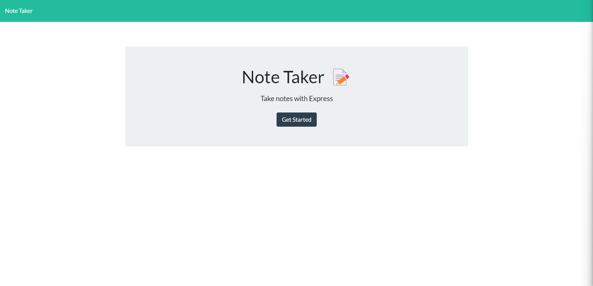

# Note Taker

## Description

- Gives the ability to enter notes and keep them logged

## Usage

- Clone the repo [here.](https://github.com/indy6678/mini-eureka-main)
- Install dependencies using "npm i".
- Run using "npm start" command.
- Access the deployed app [here.](https://floating-sands-25011.herokuapp.com/)

## Info

